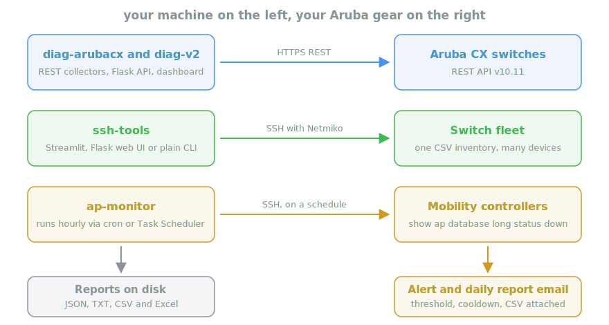

# Aruba Network Toolkit

Python tools for people who look after HPE Aruba gear and would rather not check it all by hand. This started during an internship where I had CX switches, mobility controllers and a small army of access points to keep an eye on. Doing it manually was fine for a week. Then it wasn't.

Everything runs from your machine and talks to your equipment. You bring the credentials, the repo brings the plumbing.



## What's inside

| Folder | What it does |
|---|---|
| `diag-arubacx` | Pulls system, interface and transceiver info from CX switches over the REST API. Comes with a small Flask API and an HTML dashboard |
| `diag-v2` | Second pass at the same collector, leaner and easier to extend |
| `ssh-tools` | Batch SSH for switch fleets. One CSV of switches, one list of commands, results as text or Excel. Streamlit and Flask front ends included |
| `ap-monitor` | Two monitors that watch your access points from the controller and email you when too many go down |

## How it works

There are three ways to talk to Aruba equipment and this repo covers all three.

### The polite way, over REST

`diag-arubacx` logs into the CX REST API, walks through every switch in your `devices.csv` and grabs system info, interface stats and transceiver data. Each run saves the results twice. Machines get raw JSON, humans get a CLI style text report with a timestamp in the filename. If you prefer a browser, start the Flask server and open the dashboard.

`diag-v2` does the same job with less code. If you want to build something on top, start there.

### The classic way, over SSH

Some things only come out of the CLI. The `ssh-tools` folder wraps Netmiko so you can run a list of commands against a whole fleet in one go. Pick whichever interface fits your mood:

- `sshV2.py` is a Streamlit app. Upload a CSV, type your commands, watch the output roll in
- `ssh_interface` is a small Flask web UI for the same idea
- `interface_Texte.py` and its siblings are plain scripts for when you just want text files
- `INTERFACE_Excel.py` turns the output into a formatted Excel workbook

### The lazy way, on a schedule

The best monitoring is the kind you forget about. The two tools in `ap-monitor` connect to your mobility controllers on a schedule (cron or Task Scheduler), run `show ap database long status down`, parse the table and keep a rolling history over 24 hours and 7 days.

When the number of APs down crosses your threshold, you get an email with the CSV attached. A cooldown timer keeps a flapping AP from paging you every ten minutes, and a daily report sums up the day so you don't have to count yourself.

## Quickstart

Each folder is self contained and has its own `requirements.txt`.

```bash
cd <folder>
python -m venv .venv
.venv\Scripts\activate        # source .venv/bin/activate on Linux
pip install -r requirements.txt
```

Then copy the templates and fill in your values:

```bash
copy .env.example .env                  # for the AP monitors
copy devices.csv.example devices.csv    # for the diagnostic tools
```

You need Python 3.10 or newer and network access to your gear. The diag tools expect the REST API to be enabled on your CX switches.

## A note on secrets

Nothing sensitive lives here. Credentials and device inventories stay in local files (`.env`, `devices.csv`) that the `.gitignore` refuses to commit. Copy the `.example` templates, fill in your own values and you are set.

## See also

[HPE Aruba NAE scripts](https://github.com/aruba/nae-scripts), the official collection of Network Analytics Engine scripts. Worth a look if you run CX switches.
